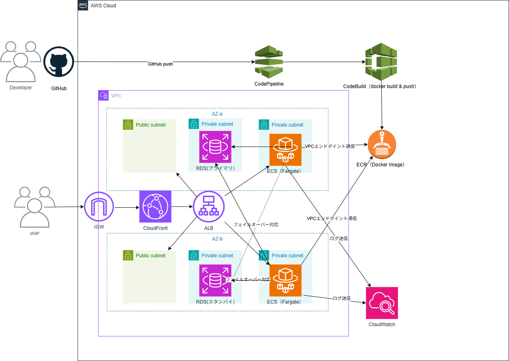

# aws-ecs-rds-cicd-access-analytics

AWSコンテナアーキテクチャ（ECS / Fargate / RDS / ALB / CloudFront / ECR）で構築したブログアクセス分析システム。CloudFormationによるIaCとCI/CDパイプラインを実装。

---

## 概要（何を作ったか・目的）

WordPressブログへのアクセス情報を収集し、アクセス数・人気記事ランキングを可視化するアクセス分析システムをAWS上に構築しました。

ブログサイトからJavaScriptでアクセスAPIへリクエストを送り、FastAPIアプリケーションがログを受信。  
Amazon RDS(MySQL)へ保存し、管理画面で以下の情報を確認できます。

- 今日のアクセス数
- 総アクセス数
- 人気記事ランキング

本プロジェクトの目的は以下です：

- ECS / Docker を用いたコンテナ運用の理解
- CloudFormationによるIaC実践
- CodePipeline / CodeBuild によるCI/CD構築
- ALB / CloudFront / VPC を含めた実践的AWS構成の理解
- RDS連携アプリケーション構築

---

## 構成 / アーキテクチャ



---

## 検証時の構成

- リージョン: ap-northeast-1（東京）
- ECS: Fargate
- DB: Amazon RDS for MySQL
- コンテナ: Python 3.11 + FastAPI
- CloudFront: HTTPS強制
- ALB: ECSへのルーティング
- ECR: Dockerイメージ管理

---

## 使用技術

## AWS

- **Amazon ECS (Fargate)**
  - FastAPIコンテナ実行基盤

- **Amazon ECR**
  - Dockerイメージ保存

- **Amazon RDS (MySQL)**
  - アクセスログ保存

- **Application Load Balancer**
  - CloudFrontからの通信をECSへ転送

- **Amazon CloudFront**
  - HTTPS配信 / ALBへのリクエスト中継

- **Amazon VPC**
  - Public / Private Subnet構成

- **AWS CloudFormation**
  - インフラ構成をコード管理（IaC）

- **AWS CodeBuild**
  - Docker build / ECR push 実行

- **AWS CodePipeline**
  - GitHub push をトリガーに自動デプロイ

- **Amazon CloudWatch Logs**
  - ECSログ監視

- **AWS Systems Manager Session Manager**
  - EC2踏み台不要の安全なサーバ接続

---

## 設計・その他

- **draw.io**：構成図作成
- **GitHub**：ソースコード管理

---

## CloudFormation構成の説明

CloudFormationテンプレートにより以下を自動構築します。

- VPC
- Public / Private Subnet
- Security Group
- ALB
- ECS Cluster
- Task Definition
- ECS Service
- ECR
- RDS
- CloudFront
- IAM Role
- CloudWatch Logs

---

## デプロイ方法

1. FastAPIソースコード・Dockerfile・buildspec.yml・CloudFormationテンプレートをGitHubへPush
2. CodePipelineが変更を検知
3. CodeBuildでDocker build実施
4. ECRへPush
5. ECSサービス更新
6. CloudFormationでインフラ管理

---

## 実装機能

### アクセスログ保存API

ブログページアクセス時に `/log` へPOSTし、DBへ保存。

### 管理画面

FastAPIのHTMLレスポンスで簡易ダッシュボードを実装。

表示内容：

- 今日のアクセス数
- 総アクセス数
- 人気記事ランキングTOP5

---

## 工夫・学習したポイント

### 1. 実務に近いAWS構成

単一サービス学習ではなく、以下を組み合わせた実践構成を採用しました。

- CloudFront
- ALB
- ECS
- RDS
- CI/CD

### 2. セキュリティ意識

- ECS / RDS を Private Subnet に配置
- ALBのみPublic公開
- Security Groupで通信制御

### 3. Docker + ECS運用

ローカル開発したFastAPIアプリをコンテナ化し、そのまま本番環境へデプロイ可能な構成を実現しました。

### 4. CORS対応

ブログドメインとAPIドメインが異なるため、FastAPI + CloudFront 双方でCORS設定を実施しました。

---

## 開発中に直面した課題と解決策

---

### ① HTTPS / ALB / CloudFront 周り

**問題**

- HTTPSでアクセスできない
- 到達不可能
- 502 Bad Gateway
- 証明書エラー（ERR_CERT_COMMON_NAME_INVALID）

**原因**

- ALBの443リスナー未設定
- Security Groupで443未許可
- ECSターゲットがunhealthy
- CloudFrontのオリジンプロトコル不一致（HTTPS→HTTP）
- DNS設定ミス（Aレコード競合）

**解決策**

- ALBへHTTPSリスナー（443）追加
- Security Groupで443許可
- ECS側ポートをALB SGから許可
- CloudFront Origin Protocol PolicyをHTTPに変更
- DNSをCloudFront経由へ統一

---

### ② CORS / ブラウザ通信エラー

**問題**

- CORSエラー
- OPTIONS 405
- fetch失敗
- POST通信不可

**原因**

- FastAPIがOPTIONS未対応
- CloudFrontがCORSヘッダーを転送していなかった

**解決策**

FastAPIでCORSMiddlewareを追加して特定のURLからの通信を許可

```python
from fastapi.middleware.cors import CORSMiddleware

app.add_middleware(
    CORSMiddleware,
    allow_origins=["https://example.com"],
    allow_credentials=True,
    allow_methods=["*"],
    allow_headers=["*"],
)
```

CloudFrontで以下を設定。

(ブラウザ情報を全部ALB/FastAPIへ中継する設定)
- Managed-AllViewer 
(CORS通信とOPTIONS確認通信に対応する設定)
- Managed-CORS-With-Preflight 

---

### ③ Mixed Content

**問題**

- HTTPSページからHTTP API通信がブロックされた

**原因**

- ブラウザ仕様によりHTTPS→HTTP通信は禁止されているため

**解決策**

- API側もHTTPS化（CloudFront経由）

---

### ④ ECS / Docker 反映されない

**問題**

GitHubへPushし、CodeBuildでECRへの新イメージ作成は成功したが、ECSサービスへ反映されず古いタスクのまま稼働していた。  
その結果、過去の `IndentationError` を含む旧コンテナが残っていた。

**原因**

- ECRのイメージは更新済み
- ECS実行タスクが新イメージへ切り替わっていなかった
- イメージ更新だけでは既存タスクは即時入れ替わらない

**解決策**

- CodeBuildでDocker build → ECR push
- ECSサービスで 「新しいデプロイの強制」 実施
- 新イメージをpullした新規タスクへ置き換え

---

### ⑤ ECR / ECS イメージ取得エラー

**問題**

- i/o timeout
- CannotPullContainerError
- 別リポジトリ参照

**原因**

- VPCエンドポイント設定不備
- Private DNS無効
- S3 Gateway Endpointなし
- イメージ未push
- TaskDefinitionのImage URI誤り

**解決策**

- `PrivateDnsEnabled: true`
- S3 Gateway Endpoint追加
- 正しいECRへpush
- タスク定義修正

---

### ⑥ CloudFormation 削除できない

**問題**

- スタック削除できない（DELETE_FAILED）

**原因**

- リソース依存関係が残っていた

**解決策**

依存関係を解除後に再削除。

```bash
aws cloudformation update-stack \
  --stack-name frontend-stack \
  --template-body file://frontend.yaml \
  --capabilities CAPABILITY_NAMED_IAM
```

### ⑦ Alembic / マイグレーション

**問題**

- alembicコマンド使えない
- script_locationエラー
- revisionエラー
- versionsフォルダなし
- MetaDataエラー

**原因**

- PATH未設定
- 初期化未実施
- DBとrevision不整合
- Base未読み込み

**解決策**

```bash
python3 -m alembic init alembic
mkdir -p alembic/versions
```

env.py修正。

```python
from models import Base
```

DBリセット。

```sql
DELETE FROM alembic_version;
```

---

### ⑧ RDS / DB接続

**問題**

- MySQL接続できない
- Access denied
- データ表示されない

**原因**

- Security Groupで3306未許可
- DB指定ミス（mysql参照）
- パスワード記述ミス
- DB / テーブル未作成
- ローカルPCから直接接続

**解決策**

- EC2 → RDS の3306許可
- DB名を `appdb` に修正
- 接続URL修正
- マイグレーション実施

```bash
alembic upgrade head
```

- EC2 / SSM経由で接続

---

### ⑨ SSM接続

**問題**

- EC2がSession Managerに表示されない

**原因**

- IAMロール未設定

**解決策**

- `AmazonSSMManagedInstanceCore` を付与
- EC2再起動


